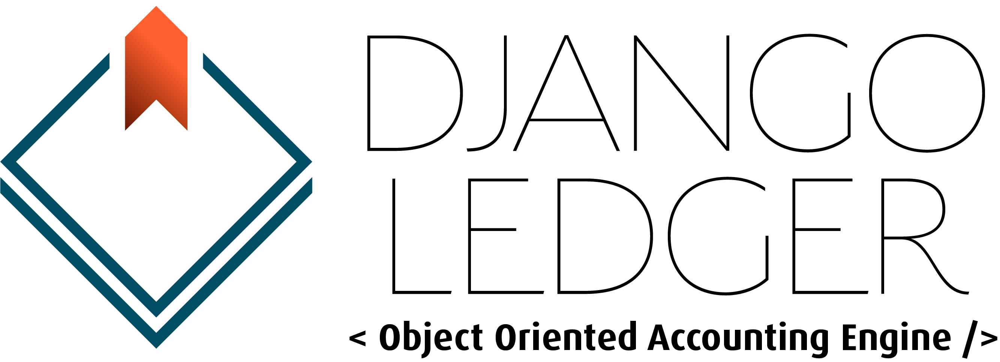
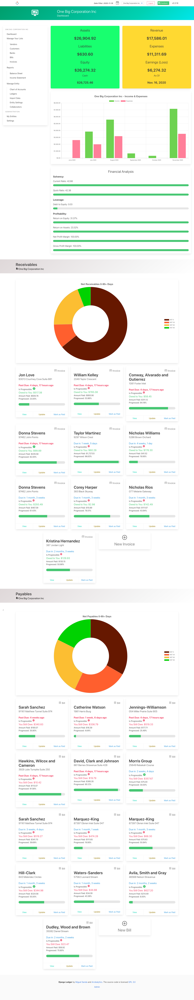
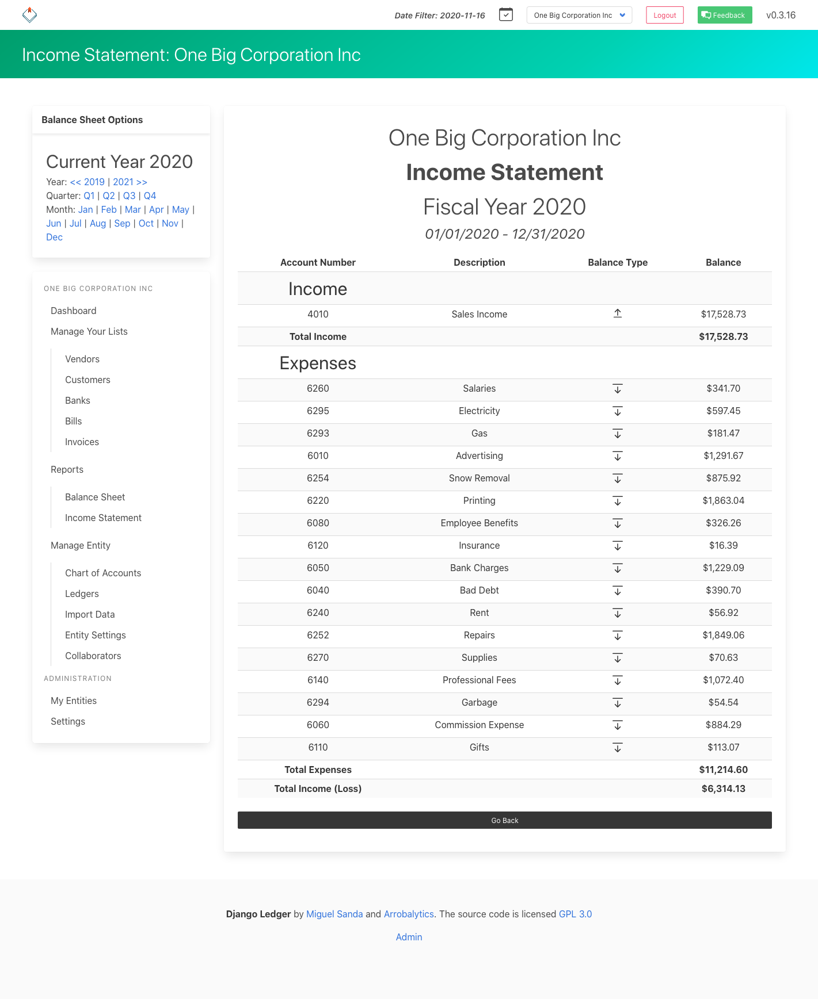
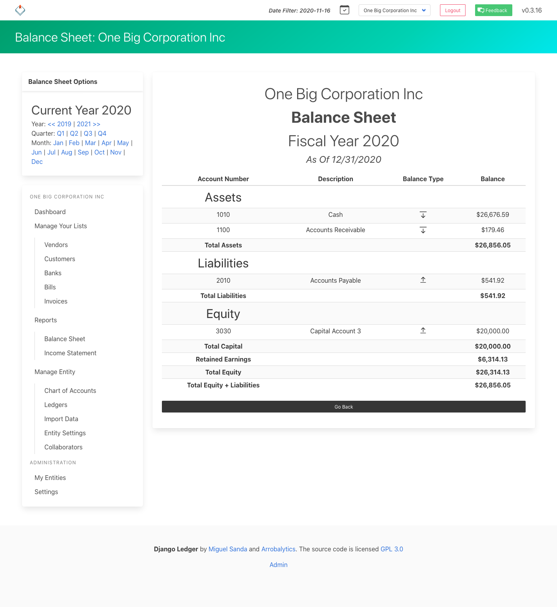
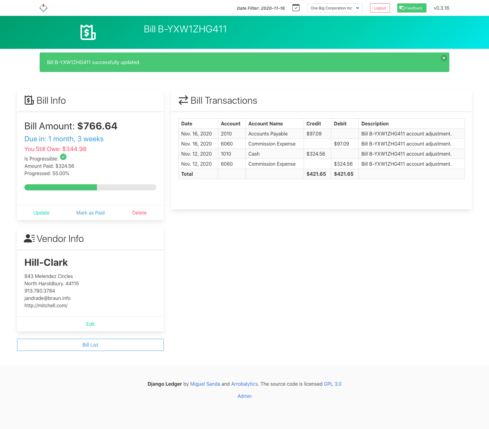
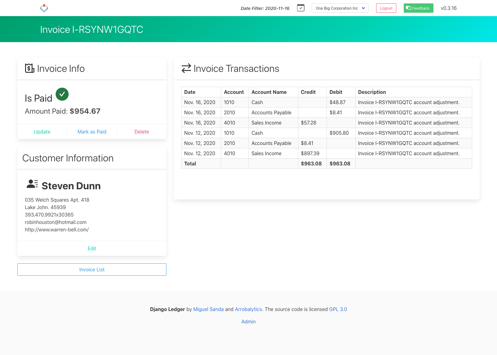
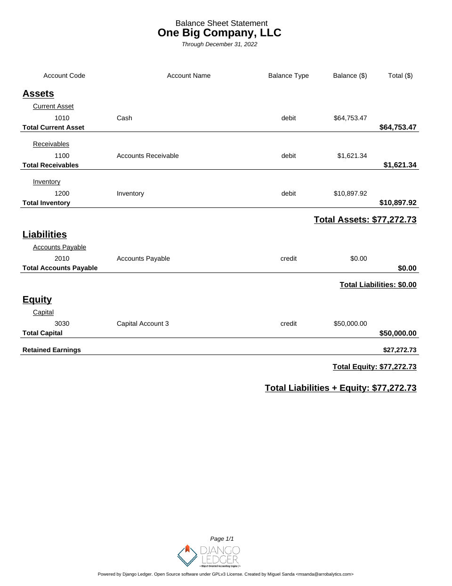
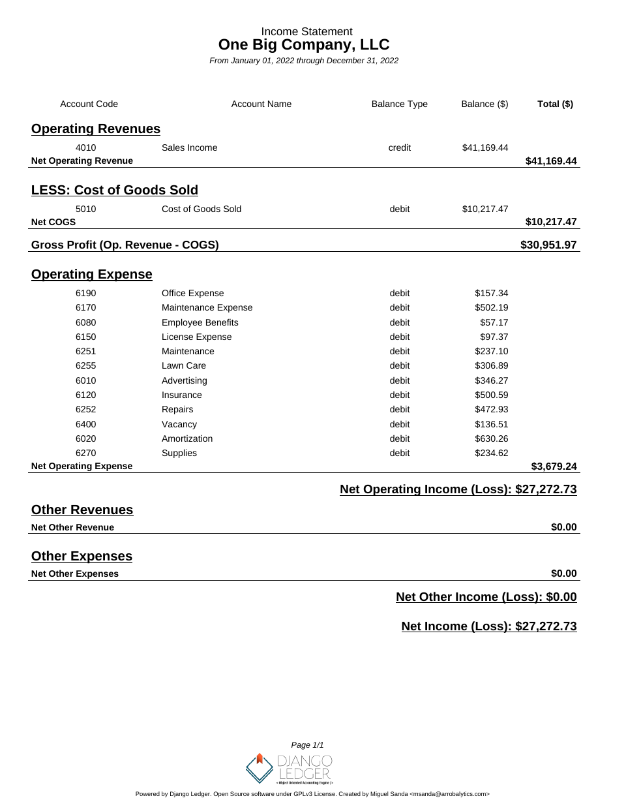
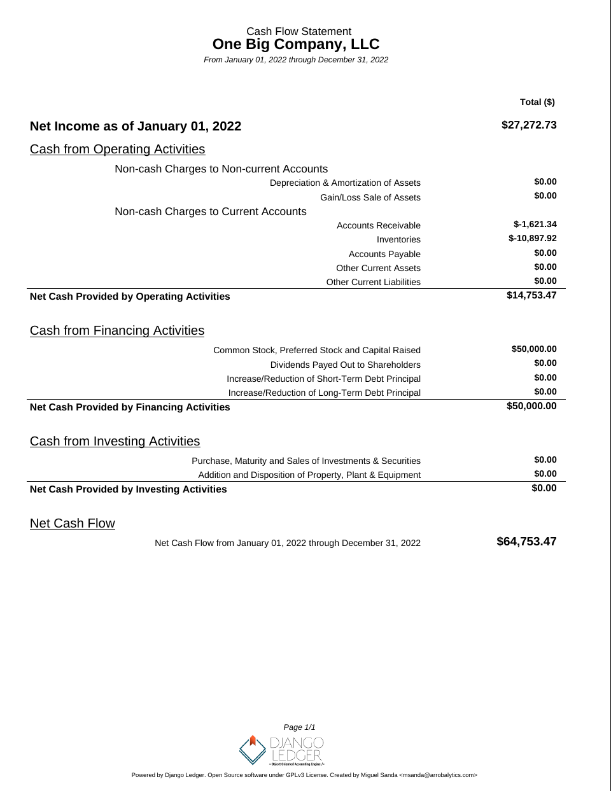

# Django Ledger

## A Double Entry Accounting Engine for Django

Django Ledger is a powerful financial management system built on the Django Web Framework. It offers a simplified API
for handling complex accounting tasks in financially driven applications.

Created and developed by [Miguel Sanda](https://www.miguelsanda.com).

This fork extends upstream django-ledger with a **regional plugin system** for country-specific accounting rules, charts of accounts, tax handling, and supporting documents. See [Regional Plugins](#regional-plugins) below.

[FREE Get Started Guide](https://www.djangoledger.com/get-started) | [Join our Discord](https://discord.gg/c7PZcbYgrc) | [Documentation](https://django-ledger.readthedocs.io/en/latest/) | [QuickStart Notebook](https://github.com/arrobalytics/django-ledger/blob/develop/notebooks/QuickStart%20Notebook.ipynb)

## Key Features

- High-level API
- Double entry accounting
- Hierarchical Chart of Accounts
- Financial statements (Income Statement, Balance Sheet, Cash Flow)
- Purchase Orders, Sales Orders, Bills, and Invoices
- Financial ratio calculations
- Multi-tenancy support
- Ledgers, Journal Entries & Transactions
- OFX & QFX file import
- Closing Entries
- Inventory management
- Unit of Measures
- Bank account information
- Django Admin integration
- Built-in Entity Management UI
- Regional plugin system for country-specific accounting (US default, Germany supported)
- Supporting documents on journal entries and ledger objects
- Entity tax profiles and bilingual account/item translations

## Getting Involved

All pull requests are welcome, as long as they address bugfixes, enhancements, new ideas, or add value to the project in
any shape or form.

Please refrain from submitting pull requests that focus solely on code linting, auto-generated code,
refactoring, or similar cosmetic non-value add changes.

- **Feature Requests/Bug Reports**: Open an issue in the repository
- **For software customization, advanced features and consulting services**:
  [Contact us](https://www.miguelsanda.com/work-with-me/) or email msanda@arrobalytics.com
- **Contribute**: See
  our [contribution guidelines](https://github.com/arrobalytics/django-ledger/blob/master/Contribute.md)

## Who Should Contribute?

We're looking for contributors with:

- Python and Django programming skills
- Finance and accounting expertise
- Interest in developing a robust accounting engine API

If you have relevant experience, especially in accounting, we welcome your pull requests or direct contact.

# Installation

Django Ledger is a [Django](https://www.djangoproject.com/) application. If you haven't, you need working knowledge of
Django and a working Django project before you can use Django Ledger. A good place to start
is [here](https://docs.djangoproject.com/en/4.2/intro/tutorial01/#creating-a-project).

Make sure you refer to the django version you are using.

The easiest way to start is to use the zero-config Django Ledger starter template. See
details [here](https://github.com/arrobalytics/django-ledger-starter).
Otherwise, you may create your project from scratch.

## Adding Django Ledger to an existing project.

### Add django_ledger to INSTALLED_APPS in you new Django Project.

```python
INSTALLED_APPS = [
    ...,
    'django_ledger',
    'django_ledger_extensions',   # supporting documents, tax profiles, translations
    'django_ledger_countries',    # country plugins (US default, DE optional)
    ...,
]
```

If you do not need regional behavior, you may omit `django_ledger_extensions` and
`django_ledger_countries`. Core django-ledger will behave as upstream (US defaults).

### Add Django Ledger Context Preprocessor

```python
TEMPLATES = [
    {
        'OPTIONS': {
            'context_processors': [
                '...',
                'django_ledger.context.django_ledger_context'  # Add this line to a context_processors list..
            ],
        },
    },
]
```

### Perform database migrations:

```shell
python manage.py migrate
```

* Add URLs to your project's __urls.py__:

```python
from django.urls import include, path

urlpatterns = [
    ...,
    path('ledger/', include('django_ledger.urls', namespace='django_ledger')),
    ...,
]
```

### Run your project:

```shell
python manage.py runserver
```

* Navigate to Django Ledger root view assigned in your project urlpatterns setting (
  typically http://127.0.0.1:8000/ledger
  if you followed this installation guide).
* Use your superuser credentials to login.

## Deprecated behavior setting (v0.8.0+)

Starting with version v0.8.0, Django Ledger introduces the DJANGO_LEDGER_USE_DEPRECATED_BEHAVIOR setting to control
access to deprecated features and legacy behaviors.

- Default: False (deprecated features are disabled by default)
- To temporarily keep using deprecated features while you transition, set this to True in your Django settings.

## Regional Plugins

> **German school / Bildungsurlaub:** step-by-step setup, tax regimes, SKR03, and quarterly VAT reports → [docs/source/de_school_howto.rst](docs/source/de_school_howto.rst)

Django Ledger uses a layered architecture so country-specific rules stay out of the core
accounting engine. **When no country is configured, behavior matches upstream django-ledger
(United States defaults).**

### Package layout

```text
django_ledger/              # Core double-entry engine + hook points
django_ledger/regional/     # Plugin contract, registry, dispatch
django_ledger_extensions/   # Shared: supporting documents, tax profiles, translations
django_ledger_countries/    # Country plugins
├── us/                     # US passthrough (default)
└── de/                     # Germany: SKR03, VAT, supporting-document rules
```

### Configuration

Set the active country in your Django settings:

```python
# Default — US behavior (same as upstream django-ledger)
# DJANGO_LEDGER_COUNTRY = 'us'

# Germany
DJANGO_LEDGER_COUNTRY = 'de'
```

Settings are resolved in this order (highest priority first):

1. Country-specific: `DJANGO_LEDGER_DE_DEFAULT_COA`, `DJANGO_LEDGER_DE_REQUIRE_SUPPORTING_DOCUMENT_ON_POST`, …
2. Global override: `DJANGO_LEDGER_CURRENCY_SYMBOL`, `DJANGO_LEDGER_REQUIRE_SUPPORTING_DOCUMENT_ON_POST`, …
3. Country plugin defaults (see `django_ledger_countries/de/settings.py` for Germany)
4. Core django-ledger defaults

| Setting | US default | DE default |
|---------|------------|------------|
| `CURRENCY_SYMBOL` | `$` | `€` |
| `REQUIRE_SUPPORTING_DOCUMENT_ON_POST` | `False` | `True` |
| `DEFAULT_COA` | upstream US chart | `skr03` |
| `DEFAULT_TAX_REGIME` | — | `exempt` |
| `DEFAULT_VAT_RATE` | — | `0.19` (standard regime only) |
| `KLEINUNTERNEHMER_PRIOR_YEAR_LIMIT` | — | `22000` |
| `KLEINUNTERNEHMER_CURRENT_YEAR_LIMIT` | — | `50000` |

Example for a German UG:

```python
DJANGO_LEDGER_COUNTRY = 'de'
DJANGO_LEDGER_DE_DEFAULT_COA = 'skr03'

# Default tax regime for new entities (change per entity in admin when Finanzamt confirms status):
# 'exempt' | 'small_business' | 'standard'
DJANGO_LEDGER_DE_DEFAULT_TAX_REGIME = 'exempt'
DJANGO_LEDGER_DE_DEFAULT_VAT_RATE = '0.19'

# Optional: override which SKR03 accounts are active in journal-entry pickers
# DJANGO_LEDGER_DE_SKR03_STARTER_CODES = ['1200 00', '8100 00', ...]
```

### Germany: SKR03 chart, tax regimes, and quarterly reports

When `DJANGO_LEDGER_COUNTRY = 'de'`, entities use the DATEV **SKR03 Schulen freie Träger** chart (~2,700 accounts). Only a **starter subset** is active by default so daily journal-entry pickers stay small; the full chart remains in the database for DATEV export and future use.

#### Load or refresh the chart

```shell
python manage.py sync_skr03 --entity=your-entity-slug
python manage.py sync_skr03 --entity=your-entity-slug --force   # re-import accounts
```

#### Tax regime (no code changes when status changes)

Each entity has an **Entity Tax Profile** (Django admin → *Entity tax profiles*). The `tax_regime` field controls VAT posting and which starter accounts stay active:

| Regime | Value | VAT on invoices | USt-Voranmeldung (ELSTER) |
|--------|-------|-----------------|---------------------------|
| School / training exempt | `exempt` | No (§ 4 UStG) | No — track turnover only |
| Kleinunternehmer | `small_business` | No (§ 19 UStG) | No — monitor turnover vs limits |
| Standard VAT | `standard` | Yes (19% default) | Yes — quarterly or monthly |

New entities default to `DJANGO_LEDGER_DE_DEFAULT_TAX_REGIME` (currently `exempt`). When your Finanzamt confirms Kleinunternehmer or school exemption (or if you switch to standard VAT):

1. Update **Entity Tax Profile → tax regime** in Django admin.
2. Re-apply the matching active account set:

```shell
python manage.py sync_tax_regime --entity=your-entity-slug
```

Posting behaviour follows the regime automatically: standard VAT splits gross invoice/bill amounts into net + Vorsteuer/Umsatzsteuer lines; exempt and Kleinunternehmer pass amounts through unchanged.

#### Quarterly VAT / turnover report

Run after journal entries for the quarter are **posted**:

```shell
# Current quarter
python manage.py vat_quarterly_report --entity=your-entity-slug

# Specific quarter
python manage.py vat_quarterly_report --entity=your-entity-slug --year=2026 --quarter=1

# JSON export (spreadsheets / handoff to Steuerberater)
python manage.py vat_quarterly_report --entity=your-entity-slug --year=2026 --quarter=1 --json
```

**Standard VAT** output includes Vorsteuer (input VAT), Umsatzsteuer (output VAT), and **Zahllast** (expected payment) for ELSTER planning.

**Kleinunternehmer** output shows quarter and year-to-date turnover against § 19 thresholds (22 000 € prior year / 50 000 € current year by default). There is no VAT return — the report helps you stay under the limits.

**Exempt** output shows turnover for your records; exempt course fees typically require no USt-Voranmeldung.

**Full walkthrough:** [German school / Bildungsurlaub how-to](docs/source/de_school_howto.rst) — setup, account list, daily booking examples, **real invoice workflows** (student fees from your class webapp, supplier bills, Beleg inbox), quarterly workflow, FAQ.

#### Real invoices (quick reminder)

When students pay through your class webapp:

1. Webapp calls `import_external_payment()` → **draft invoice**
2. Ledger UI: review → attach payment receipt (Beleg) → **Approve** → **Mark as paid**

When you receive a supplier PDF (Steuerberater, freelancer, rent): stage in **Beleg inbox** → create **Bill** → `link_beleg` → approve → mark paid when you pay.

See the how-to section *When you have real invoices* for full checklists and commands (`link_beleg`, `import_external_payment`).

#### Automation (cron)

```shell
# Daily — reminder emails (default 14 days before due dates)
python manage.py send_accounting_reminders

# One-time — seed default reminder rules per entity
python manage.py seed_accounting_reminders --entity=your-entity-slug --email=you@example.com

# Monthly hygiene
python manage.py accounting_health_check --entity=your-entity-slug
python manage.py match_bank_payments --entity=your-entity-slug --apply
python manage.py export_steuerberater --entity=your-entity-slug --year=2026
```

Configure SMTP/`EMAIL_BACKEND` in production. Override lead time with `DJANGO_LEDGER_REMINDER_DEFAULT_LEAD_DAYS = 14`.

See `docs/source/regional.rst` for plugin architecture and hook reference.

Provide a custom SKR03 chart via:

```python
DJANGO_LEDGER_DE_SKR03_DATA = [
    {'code': '1200', 'role': 'asset_ca_cash', 'balance_type': 'debit', 'name': 'Bank', 'name_en': 'Bank', 'parent': None},
    # ...
]
```

Optional S3 storage for supporting documents:

```python
DJANGO_LEDGER_SUPPORTING_DOCUMENT_STORAGE = 'storages.backends.s3boto3.S3Boto3Storage'
```

### How plugins hook into core

Country plugins implement `RegionalPlugin` (`django_ledger/regional/base.py`). Core calls
the active plugin at these points:

| Hook | When |
|------|------|
| `get_default_coa()` | Entity chart-of-accounts population |
| `register_roles()` | App startup — extend account roles |
| `on_entity_created()` | New entity saved |
| `on_coa_populated()` | Default accounts inserted |
| `adjust_posting()` | Bill/invoice ledger migration (e.g. VAT splits) |
| `validate_journal_entry()` | Before/at journal entry post |
| `on_journal_entry_posted()` | After journal entry is posted |

Extensions listen to core signals (e.g. `journal_entry_posted`) for cross-cutting behavior
such as locking supporting documents after post.

### Adding a new country

1. Create `django_ledger_countries/<code>/` with a `plugin.py` implementing `RegionalPlugin`.
2. Register the country in `django_ledger_countries/settings.py` (`_get_plugin_for_country`).
3. Add country defaults and optional `DJANGO_LEDGER_<CODE>_*` settings.
4. Add tests under `django_ledger_countries/tests/`.

See `docs/source/regional.rst` for more detail.

## Setting Up Django Ledger for Development

Django Ledger comes with a basic development environment already configured under __dev_env/__ folder not to be used
for production environments. If you want to contribute to the project perform the following steps:

1. Navigate to your projects directory.
2. Clone the repo from github and CD into project.

```shell
git clone https://github.com/arrobalytics/django-ledger.git && cd django-ledger
```

3. Install PipEnv, if not already installed:

```shell
pip install -U pipenv
```

4. Create virtual environment.

```shell
pipenv install
```

If using a specific version of Python you may specify the path.

```shell
pipenv install --python PATH_TO_INTERPRETER
```

5. Activate environment.

```shell
pipenv shell
```

6. Apply migrations.

```shell
python manage.py migrate
```

7. Create a Development Django user.

```shell
python manage.py createsuperuser
```

8. Run development server.

```shell
python manage.py runserver
```

# How To Set Up Django Ledger for Development using Docker

1. Navigate to your projects directory.

2. Give executable permissions to entrypoint.sh

```shell
sudo chmod +x entrypoint.sh
```

3. Add host '0.0.0.0' into ALLOWED_HOSTS in settings.py.

4. Build the image and run the container.

```shell
docker compose up --build
```

5. Add Django Superuser by running command in seprate terminal

```shell
docker ps
```

Select container id of running container and execute following command

```shell
docker exec -it containerId /bin/sh
```

```shell
python manage.py createsuperuser
```

6. Navigate to http://0.0.0.0:8000/ on browser.

# Run Test Suite

After setting up your development environment you may run tests.

```shell
python manage.py test django_ledger
python manage.py test django_ledger_countries
python manage.py test django_ledger_extensions
```

# Documentation

Published docs (upstream project): [django-ledger.readthedocs.io](https://django-ledger.readthedocs.io/en/latest/)

This fork adds pages under **docs/source/** — including the [German school / Bildungsurlaub how-to](docs/source/de_school_howto.rst) and [regional plugins](docs/source/regional.rst) reference. To read them locally, build the Sphinx site (requires **Python 3.11+**, same as the project).

## Install documentation dependencies

From the repository root, with your virtualenv active and the app already installed (`pip install -e .` or `pipenv install`):

**Option A — uv (recommended if you use uv):**

```shell
uv sync --group dev
```

**Option B — pip:**

```shell
pip install "sphinx>=8.2.3" "myst-parser>=4.0.1" "renku-sphinx-theme>=0.5.0"
```

The `dev` dependency group in `pyproject.toml` lists the same packages. Read the Docs uses `docs/source/requirements.txt` when building on [readthedocs.org](https://readthedocs.org/) (see `.readthedocs.yaml`).

## Build HTML

```shell
cd docs
make html
```

Output is written to `docs/build/html/`. Open the site:

```shell
# macOS
open build/html/index.html

# Linux
xdg-open build/html/index.html

# or serve locally (from docs/build/html)
python -m http.server 8080
# then visit http://127.0.0.1:8080/
```

Other useful targets (from `docs/`): `make clean`, `make help`.

**Note:** `docs/source/conf.py` loads Django (`dev_env.settings`) so autodoc can import the project. Run the build from a fully set-up dev environment, not a Sphinx-only venv.

# Screenshots







# Financial Statements Screenshots





