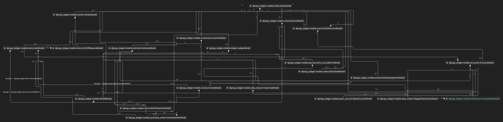
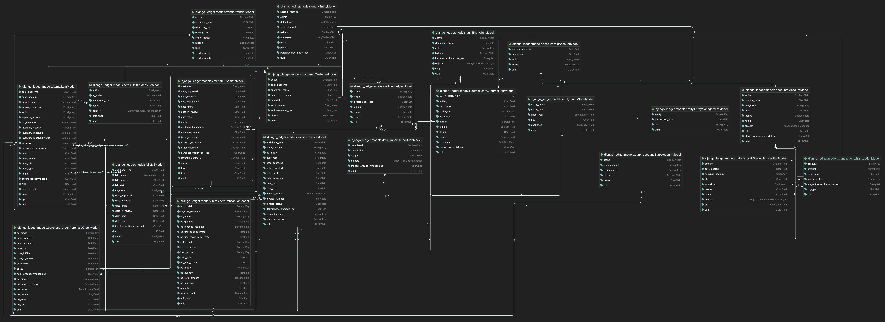

Models
======

Model Dependency Diagram
-------------------------

All abstract models will become the final implemented models.
Elaborate why...

Database Fields
---------------

Entity Model
------------
.. automodule:: django_ledger.models_abstracts.entity
    :members:

.. automodule:: django_ledger.models.entity
    :members:

Ledger Model
-------------
.. automodule:: django_ledger.models_abstracts.ledger
    :members:

.. automodule:: django_ledger.models.ledger
    :members:

Journal Entry Model
-------------------
.. automodule:: django_ledger.models_abstracts.journal_entry
    :members:

.. automodule:: django_ledger.models.journalentry
    :members:

Chart of Accounts Model
-----------------------
.. automodule:: django_ledger.models_abstracts.coa
    :members:

.. automodule:: django_ledger.models.coa
    :members:

Account Model
-------------
.. automodule:: django_ledger.models_abstracts.accounts
    :members:

.. automodule:: django_ledger.models.accounts
    :members:

Transaction Model
-----------------
.. automodule:: django_ledger.models_abstracts.transactions
    :members:

.. automodule:: django_ledger.models.transactions
    :members:
