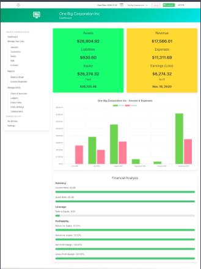

# Django Ledger


Django Ledger is an Accounting, Bookkeeping & Financial Analysis Engine for the Django Framework.

## Introduction

Django Ledger is a double-entry accounting system based on the Django Web Framework. It simplifies financial management and aims to power financially-driven applications by providing a high-level API. Prior experience with Django is required to effectively use this software.

Django Ledger is created and maintained by lead developer Miguel Sanda.

## Quick Links

- [Join our Discord Channel](https://discord.gg/c7PZcbYgrc)
- [Documentation](https://django-ledger.readthedocs.io/en/latest/)
- [QuickStart Jupyter Notebook](https://github.com/arrobalytics/django-ledger/blob/develop/notebooks/QuickStart%20Notebook.ipynb)
- [Roadmap](https://github.com/arrobalytics/django-ledger/blob/develop/ROADMAP.md)

## Features

Django Ledger supports a wide range of features, including:

- Double entry accounting.
- Hierarchical Chart of Accounts.
- Financial Statements (Income Statement, Balance Sheet & Cash Flow Statement).
- Purchase Orders, Sales Orders (Estimates), Bills, and Invoices.
- Automatic financial ratio & insight calculations.
- Multi tenancy (multiple companies/users/clients).
- Self-contained Ledgers, Journal Entries & Transactions.
- Basic OFX & QFX file import.
- Bills & Invoices with optional cash/accrual functionality.
- Entity administration & entity manager support.
- Items, lists & inventory management.
- Unit of Measures.
- Bank Accounts.

## Roadmap

The roadmap for Django Ledger includes several upcoming features and enhancements, including:

- Version 0.4.0: Items, resources, and lists for bills & invoices itemization.
- Version 0.5.0: Inventory tracking and more.
- Version 0.6: Credit Line Models, Time tracking, and more.
- Version 0.7: Currency Models, financial statements in different currencies.
- Version 0.8: User roles, permissions, and user preferences.
- Version 0.9: Hierarchical Entity Structures, Consolidated financial statements.
- Version 1.0: Complete Internationalization of all user-related fields.

## How to Contribute

Django Ledger is actively looking for contributors, especially those with financial and accounting experience. If you're interested in contributing, please refer to the [contribution guidelines](https://github.com/arrobalytics/django-ledger/blob/develop/Contribute.md).

## Installation

To install Django Ledger, follow these steps:

1. Install Django:

   ```shell
   pip install django

## Install Python Pipenv:
        pip install pipenv

## Create a new Django project:
        django-admin startproject django_ledger_project && cd django_ledger_project

## Install Django in your virtual environment:
        pipenv install django

## Install Django Ledger:
        pipenv install django-ledger[graphql,pdf]

## Activate your virtual environment:
        pipenv shell

## Add 'django_ledger' to INSTALLED_APPS in your Django project settings.
## Perform database migrations:
        python manage.py migrate

## Create a Django SuperUser:
        python manage.py createsuperuser

## Add URLs to your project's urls.py:
        urlpatterns = [
    ...,
    path('ledger/', include('django_ledger.urls', namespace='django_ledger')),
    ...,
]

## Screenshots



